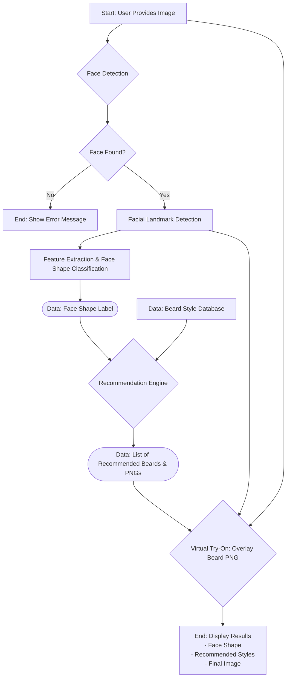

# BeardVise: AI Beard Style Recommender

)

BeardVise is a computer vision project that helps men discover the best beard styles for their face shape. It analyzes a user's photo, determines their facial structure, and suggests flattering beard styles with a "virtual try-on" feature.

---

## 🌟 Features

*   **Automatic Face Detection:** Instantly locates a face in any uploaded image or webcam feed.
*   **AI-Powered Face Shape Analysis:** Uses facial landmarks to classify face shapes into categories like Oval, Square, Round, and more.
*   **Personalized Beard Recommendations:** Suggests a curated list of beard styles that complement the user's specific face shape.
*   **Virtual Try-On:** Overlays the recommended beard styles onto the user's photo for a realistic preview.
*   **Simple Web Interface:** Easy-to-use interface for uploading photos and viewing results.

---

## ⚙️ Tech Stack

*   **Backend:** Python
*   **API Framework:** FastAPI (or Flask)
*   **Computer Vision & ML:**
    *   **MediaPipe:** For high-performance face detection and facial landmark extraction.
    *   **OpenCV:** For core image processing, manipulation, and rendering.
    *   **Scikit-learn:** For training the face shape classification model (optional, advanced).
    *   **NumPy:** For numerical operations and handling coordinates.
*   **Image Handling:** Pillow (PIL)
*   **Frontend:** HTML, CSS, JavaScript (with potential for React/Vue.js)

---

##  flowchart System Pipeline

The project follows a systematic pipeline to process the user's image and generate a recommendation.



---

## 🚀 Getting Started

Follow these instructions to get a copy of the project up and running on your local machine.

### Prerequisites

*   Python 3.8+
*   pip (Python package installer)

### Installation

1.  **Clone the repository:**
    ```bash
    git clone https://github.com/your-username/BeardVise.git
    cd BeardVise
    ```

2.  **Create and activate a virtual environment:**
    *This keeps your project dependencies isolated.*
    ```bash
    # For Windows
    python -m venv venv
    .\venv\Scripts\activate

    # For macOS/Linux
    python3 -m venv venv
    source venv/bin/activate
    ```

3.  **Install the required packages:**
    ```bash
    pip install -r requirements.txt
    ```
    *(Note: You will need to create a `requirements.txt` file containing the necessary libraries, e.g., `opencv-python`, `mediapipe`, `fastapi`, `uvicorn`)*


### How to Run

There are two ways to run this project: as a simple script or as a full web application.

**1. Run the Core Logic Script (for testing)**

Place an image named `test_image.jpg` in the root directory.

```bash
python main_script.py
```
This will process the image and save an output file `output.jpg` with the beard overlay.

**2. Run the Web Application**

Start the FastAPI server using uvicorn.

```bash
uvicorn main:app --reload
```

Now, open your web browser and navigate to `http://127.0.0.1:8000`. You can interact with the application from there.

---

## Project Structure

```
BeardVise/
├── app/
│   ├── __init__.py
│   ├── main.py             # FastAPI app logic
│   └── logic/
│       ├── __init__.py
│       ├── detector.py     # Face detection and landmark module
│       ├── classifier.py   # Face shape classification module
│       └── renderer.py     # Virtual try-on module
│
├── static/
│   ├── images/             # For UI images
│   └── styles/             # CSS files
│
├── templates/
│   └── index.html          # Main HTML page
│
├── assets/
│   └── beards/             # Transparent PNGs of beard styles
│
├── requirements.txt        # Project dependencies
├── README.md               # This file
└── .gitignore              # To exclude venv, __pycache__, etc.
```

---

## License

This project is licensed under the MIT License - see the `LICENSE` file for details.
